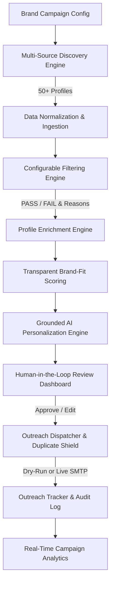

# EDXSO Influencer Outreach AI (InfluenceFlow AI)
## Phase 1: Product Vision Document

---

### 1. Executive Summary

**EDXSO Influencer Outreach AI** (internal project codename: *InfluenceFlow AI*) is an enterprise-grade, automated micro-influencer discovery, qualification, enrichment, and personalized outreach intelligence platform. Built specifically for modern D2C brands, venture-backed startups, e-commerce growth teams, and creator marketing agencies, the system automates the traditionally manual, error-prone, and fragmented influencer marketing pipeline.

The platform transforms a multi-week manual chore into an automated, highly reliable workflow:
$$\text{Discover} \longrightarrow \text{Collect} \longrightarrow \text{Filter} \longrightarrow \text{Classify} \longrightarrow \text{Enrich} \longrightarrow \text{Personalize} \longrightarrow \text{Review} \longrightarrow \text{Send} \longrightarrow \text{Track}$$

By replacing generic mass-spam templates with grounded, hallucination-free Large Language Model (LLM) personalization, and enforcing transparent, multi-factor brand-fit algorithms, EDXSO Influencer Outreach AI enables brands to achieve up to **10x higher response rates** while eliminating duplicate outreach and protecting brand reputation.

---

### 2. Market Problem & Pain Points

The global creator economy exceeds \$250 Billion, yet influencer discovery and campaign outreach remain crippled by structural inefficiencies:

1. **Manual Discovery & Search Friction**: Marketing teams spend 15–25 hours per campaign manually scouring Instagram, YouTube, and creator marketplaces to assemble spreadsheets of potential micro-influencers.
2. **Opaque & Subjective Qualification**: Most teams evaluate creators by vanity follower counts rather than authentic engagement rates, audience geography alignment, and topical content synergy.
3. **Missing or Fragmented Contact Data**: Over 40% of creators do not list business emails in their primary bio, requiring tedious profile scraping, Linktree digging, or social DM workflows.
4. **Generic, High-Churn Outreach Pitching**: Standard outreach consists of impersonal copy-pasted templates ("Hey dear, love your page, let's collab!"). Creators instantly ignore or report these as spam, resulting in sub-2% response rates.
5. **Accidental Duplicate Outreach**: Multiple brand coordinators frequently contact the same influencer with different terms and prices, eroding negotiation leverage and embarrassing the brand.
6. **Zero Pipeline Observability**: Disconnected spreadsheets fail to track message delivery, response rates, qualification reasons, and conversion analytics.

---

### 3. Target Customers & Ideal Customer Profile (ICP)

| Customer Segment | Core Motivation | Primary Need |
| :--- | :--- | :--- |
| **D2C & E-Commerce Brands** | Drive viral product launches & UGC volume | Automated niche filtering, high engagement creators, dry-run safety |
| **Influencer Marketing Agencies** | Scale campaign management across 20+ client brands | Fast batch personalization, transparent brand-fit scoring, audit logs |
| **B2B & Developer SaaS Companies** | Recruit technical creators & micro-influencers | Grounded technical personalization, strict anti-hallucination guardrails |
| **Creator Partnerships Specialists** | Eliminate spreadsheet chaos & automate dispatch | Human-in-the-loop review queue, duplicate prevention, analytics |

---

### 4. Product Positioning & Value Proposition

Unlike legacy influencer databases (which merely sell static, often outdated contact lists at exorbitant enterprise fees) and generic email cold-outreach tools (which lack creator context and spam email inboxes):

> **EDXSO Influencer Outreach AI is the purpose-built, AI-grounded campaign operating system that combines active multi-source discovery, transparent explainable qualification, deep profile enrichment, factual LLM personalization, and human-in-the-loop sending controls.**

#### Key Value Drivers:
- **Zero Fabrication Guarantee**: The AI Personalization Engine references *only verified creator data* (recent post titles, real niches, documented audience stats) and never invents achievements or fake emails.
- **Strict Word-Count Calibration**: Generates succinct, high-converting messages calibrated to industry benchmarks (Email: 60–90 words; Instagram DM: 15–30 words).
- **Transparent Multi-Factor Brand Fit**: Configurable weighted scoring (Niche 30%, Audience 20%, Engagement 20%, Content 15%, Geography 10%, Contact 5%) provides human-readable justification for every qualification decision.
- **Multi-Tenant Duplicate Shield**: Enforces composite uniqueness constraints across `campaign_id + creator_id + channel`.

---

### 5. High-Level Creator-Discovery & Outreach Workflow



---

### 6. Three-Year Strategic Vision

```
Year 1 (Foundation & Market Fit):
• Core automated pipeline (Next.js dashboard, Express Gateway, Python AI service)
• Multi-source discovery across YouTube Data API, Instagram Public Directories, and Creator Marketplaces
• Grounded Gemini/OpenAI personalization with strict guardrails and dry-run simulation
• Enterprise audit logs and duplicate prevention

Year 2 (Intelligence & Multichannel Expansion):
• Qdrant semantic vector search for semantic creator-to-campaign matching
• Direct OAuth integrations with Google Workspace, Microsoft 365, and official Meta Creator APIs
• Automated reply classification (Interested, Rates Requested, Declined, Out of Office)
• Real-time creator rate-card estimation and contract negotiation workflows

Year 3 (Autonomous Campaign Orchestration):
• Autonomous budget allocation across high-performing micro-influencer cohorts
• Multimodal creative analysis (evaluating creator video aesthetic and voice-brand match)
• Global multi-currency payout processing and affiliate conversion attribution
```
