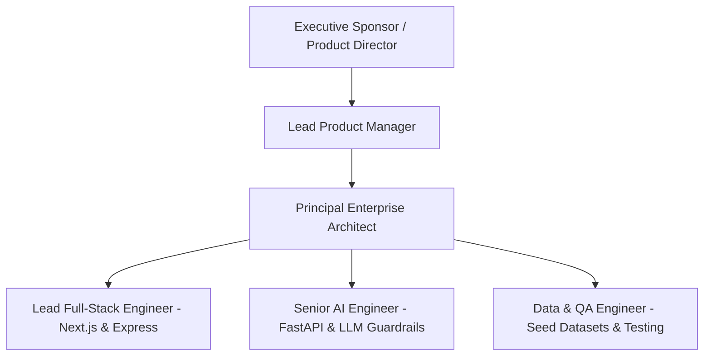

# EDXSO Influencer Outreach AI (InfluenceFlow AI)
## Phase 1: Project Charter

---

### 1. Project Purpose & Authority

This Project Charter formally establishes the engineering authority and delivery objectives for **EDXSO Influencer Outreach AI** (InfluenceFlow AI). Initiated under the EDXSO AI Engineering organization, this document mandates the creation of a production-oriented, AI-powered system designed to discover, qualify, enrich, personalize, simulate, and track micro-influencer outreach campaigns.

### 2. High-Level Objectives

1. **Discovery**: Ingest and normalize $\ge 50$ real micro-influencers per campaign from authentic creator channels (Instagram, YouTube, Creator Directories).
2. **Deterministic Qualification**: Implement transparent filtering rules evaluating follower counts ($5\text{k} - 100\text{k}$), engagement rates ($\ge 3\%$), niche relevance, and platform compatibility with explicit, human-readable PASS/FAIL reasons.
3. **Multi-Factor Brand-Fit Engine**: Expose configurable component weights (Niche 30%, Audience 20%, Engagement 20%, Content 15%, Geography 10%, Contact 5%) calculating a composite score ($0 - 100$).
4. **Grounded AI Personalization**: Generate two distinct messages per qualified creator (Email: 60–90 words; Instagram DM: 15–30 words) with zero hallucination of fake achievements, products, or credentials.
5. **Human-in-the-Loop & Dispatcher**: Deliver an interactive approval dashboard with dry-run email simulation and strict duplicate outreach blocking ($`\text{campaign\_id} + \text{creator\_id} + \text{channel}`$).
6. **Observability & Analytics**: Track the full outreach lifecycle, logging timestamps, delivery statuses, retry counts, and funnel conversion rates.

---

### 3. Engineering Team & Stakeholder Governance

#### RACI Matrix

| Activity | Product Manager | Enterprise Architect | AI Engineer | Full-Stack Dev | QA / Data |
| :--- | :---: | :---: | :---: | :---: | :---: |
| **Requirements & Scope Definition** | **A** | **R** | C | C | I |
| **Monorepo & System Architecture** | I | **A / R** | C | R | I |
| **Filtering & Brand-Fit Logic** | C | A | **R** | R | C |
| **LLM Personalization & Guardrails** | C | A | **R** | C | R |
| **API Gateway & Duplicate Shield** | I | A | C | **R** | C |
| **Next.js Dashboard UI/UX** | C | A | I | **R** | C |
| **Unit, Integration & E2E Testing** | I | A | R | R | **R** |

*Legend: R = Responsible, A = Accountable, C = Consulted, I = Informed*

---

### 4. Strict Project Scope Boundaries

#### ✅ IN-SCOPE:
- Automated micro-influencer discovery and schema normalization.
- Multi-criteria filtering engine with explainable PASS/FAIL output.
- Profile enrichment with public business emails, content themes, and confidence metrics.
- Multi-factor brand fit score calculation ($0-100$) with component breakdowns.
- Grounded AI personalization (60–90 word email, 15–30 word Instagram DM).
- Human-in-the-loop review workflow (Approve, Edit, Reject, Skip).
- Duplicate prevention engine enforced via compound keys.
- Sending layer with configurable dry-run simulation mode (`DRY_RUN=true`).
- Real-time campaign funnel analytics.

#### ❌ EXPLICITLY OUT-OF-SCOPE (Critical Non-Negotiable Rule):
- **NO CV, Resume, or ATS scoring mechanisms.**
- **NO candidate hiring or recruitment ranking algorithms.**
- **NO portfolio analysis or OmniScore AI features.**
- **NO bypassing of platform CAPTCHAs, bot protections, or private account restrictions.**
- **NO fabrication of non-public creator email addresses.**

---

### 5. Milestone & Deliverable Schedule

| Phase | Milestone Name | Key Deliverables | Status |
| :---: | :--- | :--- | :---: |
| **M1** | Discovery & Requirements | Vision Doc, Project Charter, BRD, FRD, SRS, Persona Maps | **COMPLETED** |
| **M2** | Core AI & Filtering Service | Python FastAPI service, Filtering Engine, Brand Fit Engine, Unit Tests | **COMPLETED** |
| **M3** | API Gateway & Orchestrator | Express Gateway, Duplicate Shield, Store, Outreach Service, Tests | **COMPLETED** |
| **M4** | Next.js Frontend Dashboard | App Router UI, Creator Table, AI Review Studio, Analytics | **IN PROGRESS** |
| **M5** | End-to-End Verification | Cross-service testing, Browser subagent validation, Demo walk-through | **PENDING** |
| **M6** | Final Documentation & Handoff | Complete SDLC documentation, README, Runbooks, Docker config | **PENDING** |
