# EDXSO Influencer Outreach AI (InfluenceFlow AI)
## Phase 1: Functional Requirements Document (FRD)

---

### 1. Functional System Architecture

```mermaid
graph LR
    subgraph Ingestion & Filtering
        FR1[FR-101: Ingestion Engine] --> FR2[FR-102: Normalization]
        FR2 --> FR3[FR-103: Filtering & Pass/Fail Evaluator]
    end

    subgraph Enrichment & Scoring
        FR3 --> FR4[FR-104: Profile Enrichment]
        FR4 --> FR5[FR-105: Multi-Factor Brand-Fit Engine]
    end

    subgraph AI Generation & HITL
        FR5 --> FR6[FR-106: Personalization Engine]
        FR6 --> FR7[FR-107: Guardrail Validator]
        FR7 --> FR8[FR-108: Review & Approval Studio]
    end

    subgraph Dispatch & Analytics
        FR8 --> FR9[FR-109: Duplicate Prevention Shield]
        FR9 --> FR10[FR-110: Dispatcher & SMTP/Dry-Run]
        FR10 --> FR11[FR-111: Outreach Log & Tracker]
        FR11 --> FR12[FR-112: Campaign Analytics Engine]
    end
```

---

### 2. Detailed Functional Specifications

#### FR-101: Creator Profile Ingestion
- **Input**: Public directory entries, YouTube API response payloads, Instagram public metadata.
- **Output**: Array of raw creator JSON objects.
- **Validation**: Ensures presence of identifier, handle, platform, and numerical follower/engagement values.

#### FR-102: Schema Normalization
- Maps heterogeneous platform data into the unified canonical `CreatorProfile` model:
  `creator_id`, `name`, `username`, `platform`, `profile_url`, `follower_count`, `engagement_rate`, `category`, `niche`, `content_themes`, `contact_email`, `email_source`, `email_confidence`, `website`, `audience_age`, `audience_gender`, `audience_geography`, `recent_content`, `discovery_source`, `posting_frequency`, `brand_collaborations`.

#### FR-103: Explainable Filtering Engine
- Evaluates each creator against 5 specific rules:
  1. $5,000 \le \text{follower\_count} \le 100,000$
  2. $\text{engagement\_rate} \ge 3.0\%$
  3. $\text{niche} \in \text{campaign.sub\_niches}$ or $\text{category} == \text{campaign.niche}$
  4. $\text{platform} \in \text{campaign.target\_platforms}$
  5. $\text{matching content signals} \ge 1$
- Returns `status: "PASS" | "FAIL"` and an array of granular explanation strings prefixed with `✓` or `✗`.

#### FR-104: Profile Enrichment Engine
- Enriches shortlisted profiles with business contact email, bio links, audience demographic estimates, and past brand collaborations.
- Emits confidence indicators: `"high"` (verified profile/bio link), `"medium"` (secondary listing), or `"not_found"`.
- Explicit rule: Any missing field MUST contain `"Not Found"`. Guessing or synthetic generation of emails is strictly prohibited.

#### FR-105: Brand-Fit Scoring Engine
- Computes multi-factor composite score ($0 - 100$):
  $$\text{BrandFit} = 0.30 \cdot S_{\text{niche}} + 0.20 \cdot S_{\text{audience}} + 0.20 \cdot S_{\text{engagement}} + 0.15 \cdot S_{\text{content}} + 0.10 \cdot S_{\text{geography}} + 0.05 \cdot S_{\text{contact}}$$
- Exposes each sub-score and human-readable explanation in the API and UI.

#### FR-106: AI Personalization Engine
- Synthesizes personalized pitch copy using grounded creator context:
  - **Email Pitch**: Target $60 - 90$ words. Structure: Friendly greeting $\to$ specific recent post praise $\to$ brand value prop $\to$ audience fit $\to$ collaboration offer $\to$ low-friction CTA $\to$ sign-off.
  - **Instagram DM Pitch**: Target $15 - 30$ words. Structure: Enthusiastic greeting $\to$ recent content reference $\to$ partnership teaser $\to$ question CTA.

#### FR-107: Anti-Hallucination Guardrail Validator
- Inspects generated text before storage:
  - Validates word counts ($60 \le \text{words}_{\text{email}} \le 90$; $15 \le \text{words}_{\text{DM}} \le 30$).
  - Confirms referenced post exists in creator's `recent_content` array.
  - Ensures no invented statistics or fabricated claims.
  - Generates `GuardrailReport` object with boolean flags.

#### FR-108: Human-in-the-Loop Review Studio
- UI enables partnerships managers to view creator profile, brand-fit breakdown, and generated copy.
- Actions:
  - **Approve**: Transitions status to `Human Approved`.
  - **Inline Edit**: Updates text directly, re-counts words in real time, and marks status as `Edited`.
  - **Reject / Skip**: Prevents creator from being queued for outreach.

#### FR-109: Duplicate Prevention Shield
- Inspects database prior to any sending operation:
  - Query: Check if record exists matching `campaign_id` AND `creator_id` AND `channel` with status in `["SENT", "SIMULATED"]`.
  - If match found: Block dispatch, return `duplicate_prevented: true`, log event, and notify user.

#### FR-110: Outreach Dispatcher
- Evaluates `DRY_RUN` environment flag:
  - If `true`: Simulates dispatch, logs simulated delivery timestamp, sets status to `SIMULATED`.
  - If `false` and `Email`: Connects to configured SMTP server, sends RFC-compliant message, records SMTP `messageId`, sets status to `SENT`.
  - If `Instagram_DM`: Generates ready-to-copy payload with deep-link to creator's profile, logs manual preparation status.

#### FR-111: Outreach Tracker & Audit Logging
- Maintains immutable audit records in store:
  `outreach_id`, `campaign_id`, `creator_id`, `creator_name`, `recipient`, `channel`, `subject`, `message_body`, `status`, `sent_at`, `error`, `retry_count`, `is_dry_run`, `notes`.

#### FR-112: Campaign Analytics Aggregator
- Dynamically computes funnel metrics (Discovered, Qualified, Rejected, Enriched, Messages Generated, Outreach Simulated/Sent, Duplicates Prevented).
- Computes average engagement rate, Brand Fit distribution, and channel split.
