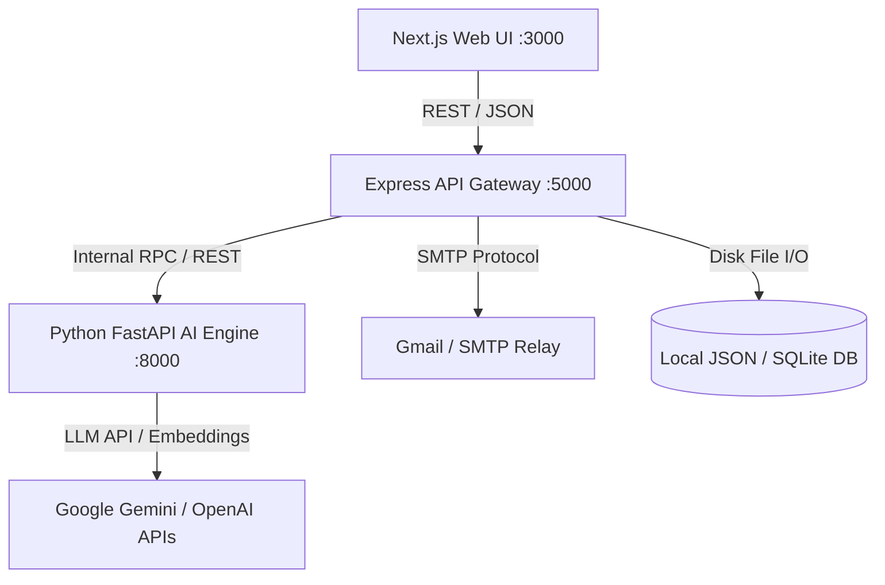

# EDXSO Influencer Outreach AI (InfluenceFlow AI)
## Phase 1: Software Requirements Specification (SRS) - IEEE 830 Standard

---

### 1. Introduction

#### 1.1 Purpose
This document provides the formal Software Requirements Specification for **EDXSO Influencer Outreach AI** (InfluenceFlow AI). It establishes the technical constraints, interface definitions, functional capabilities, and performance criteria for the production system.

#### 1.2 Scope
The software system comprises:
1. **Next.js Web Application**: Interactive dashboard for campaign management, creator vetting, AI review studio, and analytics.
2. **Node.js/Express API Gateway**: Campaign orchestration, duplicate prevention shield, SMTP/Dry-run dispatcher, and persistence.
3. **Python FastAPI AI Service**: Ingestion, schema normalization, filtering evaluator, brand-fit algorithm, and LLM personalization engine.
4. **Data Layer**: Structured campaign and outreach logs, JSON/SQLite persistence, and seed creator datasets.

#### 1.3 Definitions, Acronyms & Abbreviations
- **UGC**: User Generated Content.
- **Micro-Influencer**: A content creator having between 5,000 and 100,000 followers.
- **Engagement Rate**: The percentage of followers interacting with posts: $\frac{\text{Likes} + \text{Comments}}{\text{Followers}} \times 100$.
- **HITL**: Human-in-the-Loop.
- **Dry-Run**: Simulated execution mode that produces valid logs without transmitting real external emails.

---

### 2. Overall Description

#### 2.1 Product Perspective & Context

#### 2.2 User Characteristics
- **Campaign Managers & Growth Leads**: Non-developer users seeking fast, accurate creator vetting and high-converting copy without technical configuration.
- **Partnerships Specialists**: Daily operators approving pitches, editing copy, and monitoring reply statuses.

#### 2.3 Operating Environment
- **Operating Systems**: Windows 11 / Linux (Ubuntu 22.04 LTS) / macOS.
- **Runtimes**: Node.js v20.x or v22.x, Python 3.11+.
- **Browsers**: Chromium-based (Chrome, Edge), Firefox, Safari (desktop viewports $\ge 1280\text{px}$).

---

### 3. Specific Requirements & System Interfaces

#### 3.1 External Interface Requirements

##### 3.1.1 User Interface (UI)
- The UI shall be built with Next.js (App Router), React 19, and Tailwind CSS.
- The UI shall provide a dark-mode first, glassmorphism aesthetic with high-contrast typography, interactive modals, responsive tables, and badge indicators.
- All actions (Discover, Approve, Edit, Send, Filter) shall provide visual loading spinners and toast notifications.

##### 3.1.2 Software Interfaces (REST APIs)
| Method | Route | Description |
| :--- | :--- | :--- |
| `GET` | `/health` | Health check for gateway and AI service connectivity |
| `GET` | `/api/v1/campaigns` | List all configured campaigns |
| `POST` | `/api/v1/campaigns` | Create a new campaign with target criteria |
| `POST` | `/api/v1/campaigns/:id/discover` | Trigger discovery, filtering, and personalization |
| `GET` | `/api/v1/campaigns/:id/creators` | Retrieve enriched creators with Pass/Fail results |
| `PATCH` | `/api/v1/campaigns/:id/creators/:creatorId/review` | Update human review status and edited copy |
| `POST` | `/api/v1/outreach/send` | Dispatch single outreach with duplicate prevention |
| `POST` | `/api/v1/outreach/batch-send` | Dispatch batch outreach to all qualified creators |
| `GET` | `/api/v1/outreach` | Retrieve full outreach audit logs |
| `GET` | `/api/v1/campaigns/:id/analytics` | Retrieve real-time funnel and brand-fit metrics |

---

### 4. Non-Functional Requirements (NFRs)

#### 4.1 Performance & Latency
- Discovery and filtering pipeline evaluation for 50 creators shall complete in under **3.5 seconds** when running grounded synthesis.
- API response times for creator listing and analytics shall be under **150ms**.
- Email dispatch in dry-run mode shall process within **50ms** per creator.

#### 4.2 Security & Compliance
- **Data Protection**: Creator public contact data shall not be exposed to unauthorized external crawlers.
- **Credential Safety**: SMTP passwords and LLM API keys must strictly reside in environment variables (`.env`) and never be committed to source code or returned in client responses.
- **Platform Compliance**: The system shall never scrape authenticated private pages or bypass platform access controls.

#### 4.3 Reliability & Error Tolerance
- Failure of an individual creator's profile enrichment or personalization shall NOT abort the campaign pipeline. Failed records shall be logged with error states while the remaining creators continue through the pipeline.
- Network timeouts to external LLMs shall automatically trigger fallback to the deterministic grounded synthesis engine.
