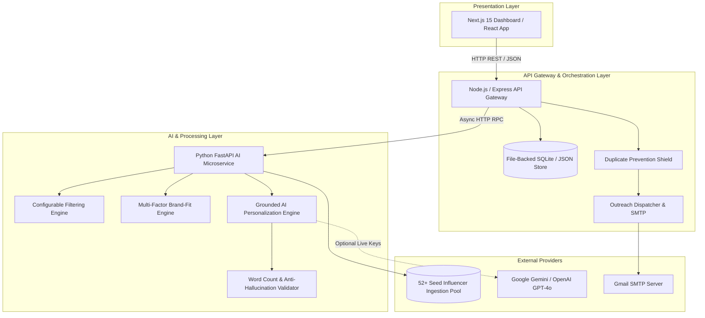
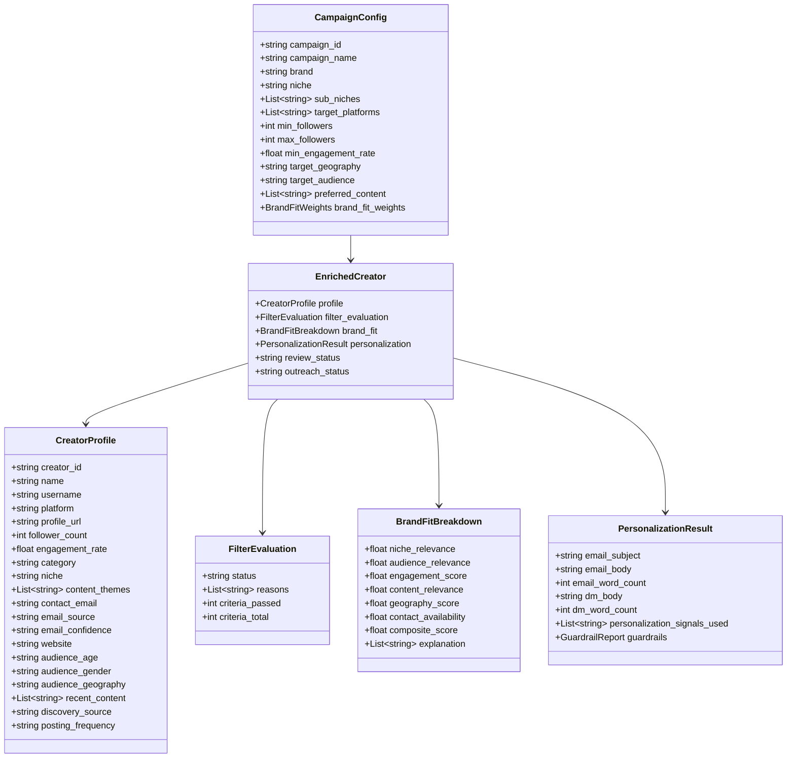
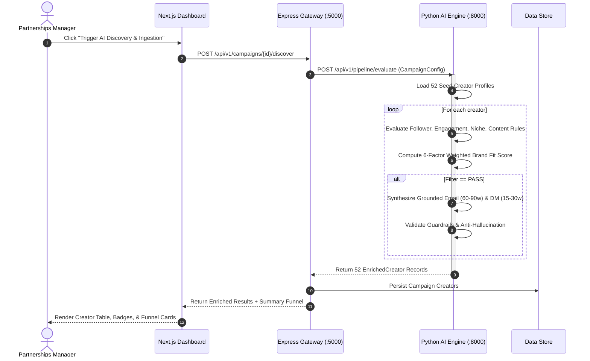
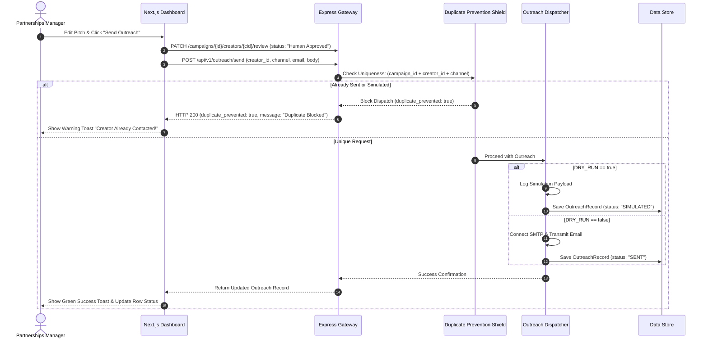

# EDXSO Influencer Outreach AI (InfluenceFlow AI)
## Phase 4: High-Level Design (HLD) & Low-Level Design (LLD)

---

### 1. High-Level Design (HLD)

#### 1.1 Architectural Topology
The platform employs a modular service-oriented architecture designed to isolate concerns, provide independent scaling, and allow easy substitution of external LLM or data providers:

---

### 2. Low-Level Design (LLD)

#### 2.1 Core Domain Models

---

### 3. Detailed Sequence Diagrams

#### 3.1 End-to-End Campaign Discovery & Qualification Sequence

#### 3.2 Human Review, Duplicate Shield & Outreach Sequence

