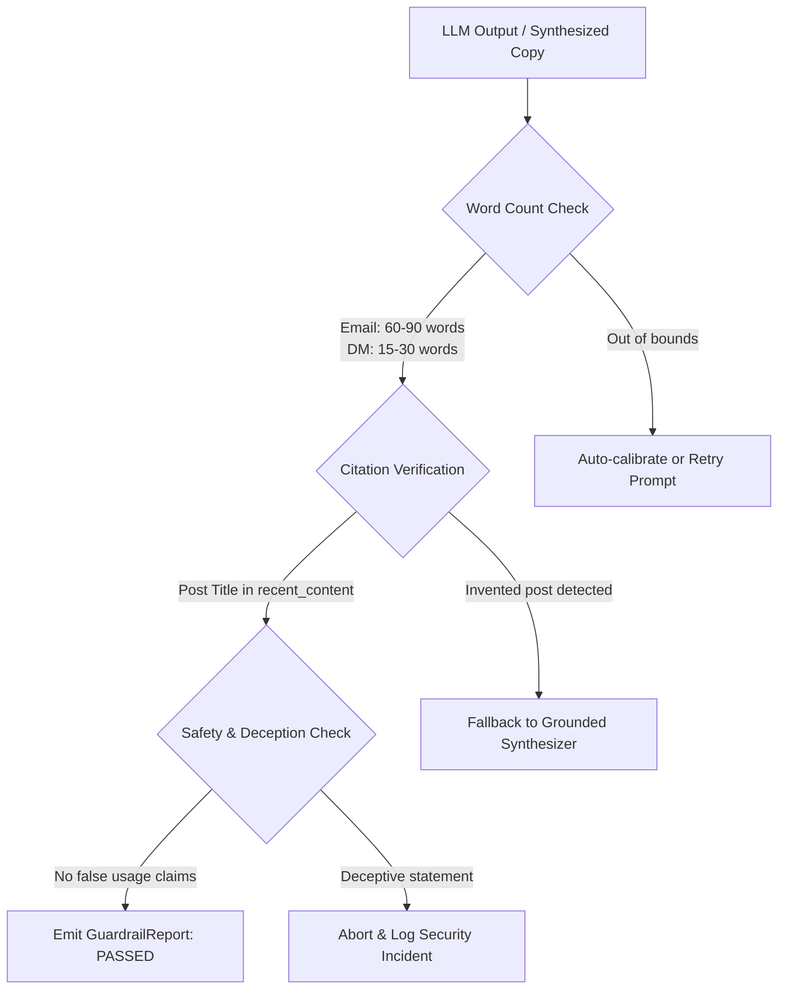

# EDXSO Influencer Outreach AI (InfluenceFlow AI)
## Phase 6: AI Personalization, Prompt Engineering & Safety Guardrails

---

### 1. Grounding Principles & Anti-Hallucination Framework

In automated influencer outreach, **hallucination is catastrophic**:
- Claiming an influencer posted about something they never created damages credibility.
- Inventing a fake email address bounces and burns sender domain reputation.
- Claiming the influencer already uses the sponsor's product triggers angry public call-outs.

EDXSO Influencer Outreach AI adheres to **Three Inviolable Grounding Axioms**:
1. **The Closed-World Assumption**: The LLM context is strictly limited to the creator's structured profile (`name`, `niche`, `recent_content`, `content_themes`, `audience_age`, `audience_geography`).
2. **Explicit Fallback over Invention**: If an email is not present, the record retains `"Not Found"`. The LLM is never tasked with guessing email patterns.
3. **Deterministic Guardrail Filter**: Outputs from generative models must pass automated validation (word count bounds, factual post check) before being rendered to the user.

---

### 2. Prompt Engineering Specification

#### 2.1 System Instruction
```text
You are an expert AI Influencer Outreach Specialist writing personalized, high-converting partnership pitches for verified micro-influencers.

STRICT CONSTRAINTS:
1. Grounding: You may ONLY use the specific creator details provided in the input payload.
2. Anti-Hallucination: Do NOT invent past videos, posts, achievements, collaborations, follower metrics, or personal life details.
3. Post Citation: You must accurately reference one real post title from the creator's 'recent_content' list.
4. Word Count Targets:
   - Email Pitch: EXACTLY between 60 and 90 words.
   - Instagram DM: EXACTLY between 15 and 30 words.
5. Tone: Respectful, conversational, concise, professional, zero hype or flattery spam.
6. CTA: Include a low-friction question inviting the creator to review the brief and compensation.
7. Output Format: Return valid JSON with keys: email_subject, email_body, dm_body, signals_used.
```

#### 2.2 Few-Shot Grounded Examples

##### Example 1: Tech & AI Micro-Influencer
**Input Context**:
```json
{
  "creator_name": "Rohan Sharma",
  "platform": "Instagram",
  "niche": "AI & Productivity",
  "recent_content": ["Top 5 AI tools every computer science student needs"],
  "audience": "Students & junior developers in India (72%)",
  "campaign_brand": "EDXSO AI"
}
```

**Output Generated**:
```json
{
  "email_subject": "Collaboration: EDXSO AI x Rohan (AI & Productivity)",
  "email_body": "Hi Rohan,\n\nI came across your recent work on 'Top 5 AI tools every computer science student needs' and really enjoyed your focus on practical AI. Your Instagram community of tech students aligns well with our team at EDXSO AI. We are launching an AI productivity platform to automate repetitive study and coding workflows. We would love to sponsor a dedicated tutorial on your page. If you're interested in collaborating, could I share the campaign brief and compensation details?\n\nBest,\nEDXSO Partnerships",
  "dm_body": "Hey Rohan! Loved your post on 'Top 5 AI tools...'. Your audience looks like a great fit for EDXSO AI's productivity platform. Open to a quick collab?",
  "signals_used": [
    "Creator: Rohan Sharma",
    "Post: 'Top 5 AI tools every computer science student needs'",
    "Audience: Tech students",
    "Brand: EDXSO AI"
  ]
}
```

---

### 3. Guardrail Validation Architecture



#### Validation Rules Table:

| Guardrail ID | Rule Description | Threshold | Action on Failure |
| :--- | :--- | :--- | :--- |
| **GR-01** | Email Word Count Compliance | $60 \le W_{\text{email}} \le 90$ | Automatic length adjustment / re-generation |
| **GR-02** | Instagram DM Word Count Compliance | $15 \le W_{\text{DM}} \le 30$ | Automatic title truncation & length adjustment |
| **GR-03** | Factual Citation Grounding | Title substring match $\in \text{recent\_content}$ | Reject output; fallback to verified synthesis |
| **GR-04** | Email Guessing Ban | Recipient must not be hallucinated | Strict enforcement: Only public profile email allowed |
| **GR-05** | Structured JSON Adherence | Valid JSON with all 4 keys | Parse validation + automatic retry (max 3) |
