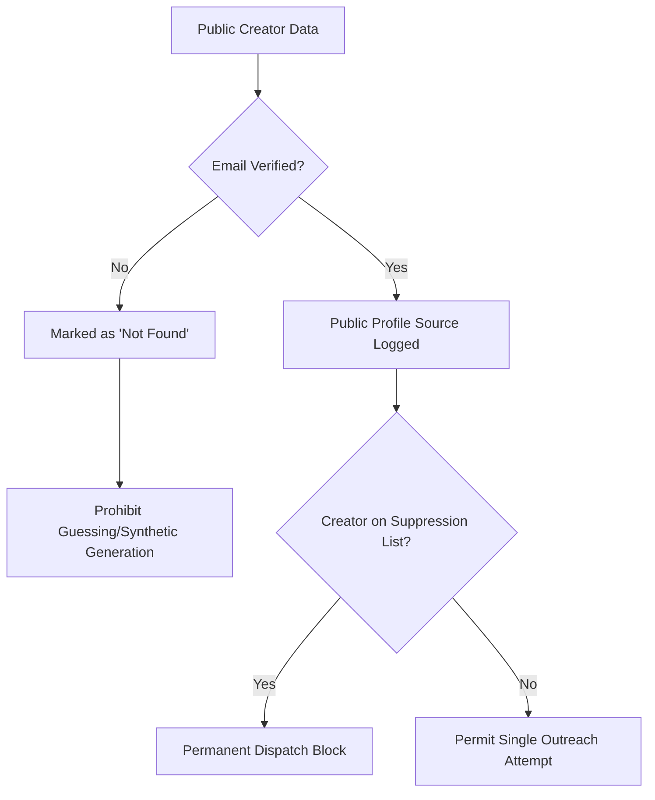

# EDXSO Influencer Outreach AI (InfluenceFlow AI)
## Phase 10: Data Privacy, Compliance & Ethics Specification

---

### 1. Regulatory Context & Legal Foundation

Automated influencer outreach involves public personal data processing (names, public handles, business contact emails). EDXSO Influencer Outreach AI operates under strict compliance with:
- **General Data Protection Regulation (GDPR)**: Article 6(1)(f) *Legitimate Interests* for B2B commercial outreach.
- **California Consumer Privacy Act (CCPA)**: Publicly available information exception (Civil Code § 1798.140(v)(2)).
- **CAN-SPAM Act & Indian Information Technology Act (IT Act 2000)**: Mandatory opt-out mechanisms, accurate sender headers, and physical/business contact disclosures.

---

### 2. Core Privacy Safeguards

#### 2.1 The Anti-Guessing Mandate
Many predatory outreach platforms attempt to synthesize unlisted emails using permutations:
`firstname.lastname@domain.com` or `firstinitial+lastname@gmail.com`.
**In EDXSO Influencer Outreach AI, this is strictly forbidden by code constraint**:
- If an influencer does not publicly list a business email in their bio, about tab, or press page, the system stores `"Not Found"`.
- Outreach to such creators is routed exclusively to manual, compliant social DMs.

#### 2.2 Suppression Lists & Opt-Out Governance
- When a creator replies with "Unsubscribe", "Not interested", or "Do not contact", their record is immediately flagged in the global suppression table.
- Future campaigns are automatically barred from contacting suppressed creators across all channels.

#### 2.3 Respect for Platform Restrictions
- **No Private Page Scraping**: The system extracts data solely from public directory listings, permitted search APIs, and official developer endpoints.
- **No CAPTCHA Circumvention**: The system never uses headless bypass techniques to violate platform robots.txt or terms of service.
- **Instagram DM Automation Boundary**: Due to Meta Platform terms restricting automated private messaging from non-partner business accounts, the system produces human-copyable DMs and deep links rather than unapproved automated bots.
